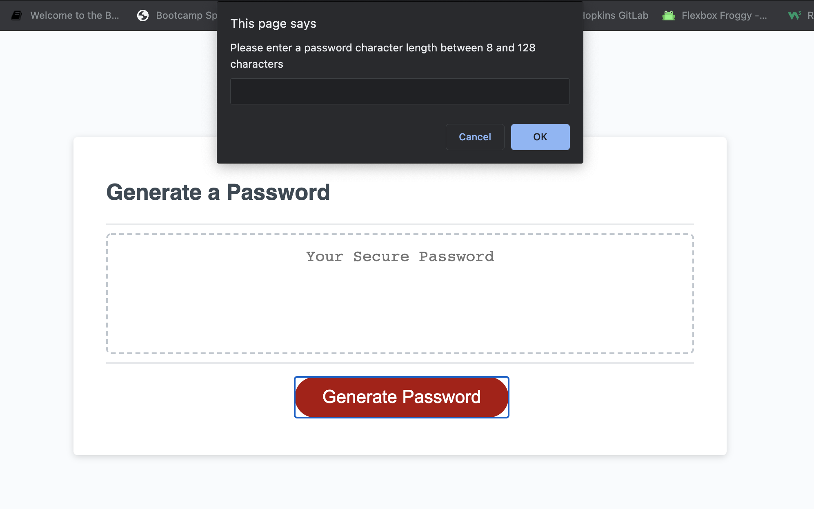

# passcode-generator

When the user accesses this passcode generator, the user will be presented with a series of questions prompting them to set the criteria for their password:
 - Choose the character length, no less than 8 and no more than 128 characters
 - Do you want lowercase letters?
 - Do you want uppercase letter?
 - Do you want numbers?
 - Do you want special characters?

 Based on the user's responses to each prompt, a random password will generate based on the criteria set by the user.

 Below is a preview of the passcorde gernerator.

 